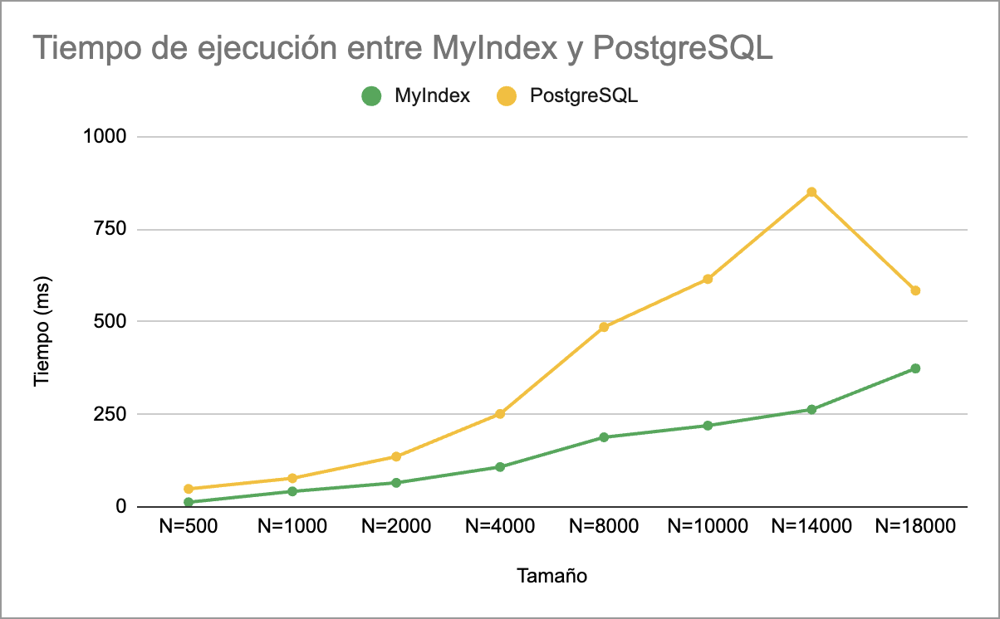

# Data Fusion


## Introducción

### Objetivo del Proyecto

Desarrollar un sistema integral de base de datos multimedia que optimice la búsqueda y recuperación de información, implementando un índice invertido para documentos de texto y una estructura multidimensional para la búsqueda eficiente de imágenes, audio y otros objetos multimedia.

### Descripción del dataset

Se utilizó una base de datos de Kaggle ([dataset](https://www.kaggle.com/datasets/imuhammad/audio-features-and-lyrics-of-spotify-songs?resource=download)) que contiene 18,000 registros de canciones junto con su información asociada. Cada entrada incluye atributos como `track_id` (ID de la canción), `track_name` (nombre de la canción), `track_artist` (nombres del artista), `track_popularity` (indicador de popularidad), `playlist_genre` (géneros musicales) y `lyrics` (letras de las canciones). Este conjunto de datos ofrece una amplia variedad de características relacionadas con las canciones y sus artistas, lo que lo convierte en una valiosa fuente para análisis musicales y tareas de recuperación de información.

### Importancia de Aplicar Indexación

La indexación es esencial para mejorar la eficiencia y velocidad en la recuperación de información, tanto en bases de datos relacionales como en sistemas de búsqueda. Los índices permiten organizar los datos de manera estructurada, facilitando consultas rápidas, especialmente en grandes volúmenes de información. Además de los índices tradicionales, los índices multidimensionales son fundamentales para manejar datos complejos, como imágenes o audio, ya que permiten realizar búsquedas eficientes en espacios con múltiples características o dimensiones. En conjunto, estos métodos optimizan el rendimiento, reducen los tiempos de respuesta y mejoran la escalabilidad de los sistemas.

## Backend

> ## Proyecto 2: Indice Invertido Textual

### 1. Construcción del índice invertido en memoria secundaria

El algoritmo SPIMI (Single Pass In-Memory Indexing) es un método eficiente para construir un índice invertido en memoria secundaria, dividiendo el trabajo en bloques y luego fusionándolos.

```python
def spimi_invert(self):
        if not os.path.exists(self.path):
            os.makedirs(self.path)

        block_count = 0
        dictionary = defaultdict(dict)

        # Usar paralelización para distribuir el procesamiento de documentos
        for i, (doc_id, words) in enumerate(self.dataset.items()):
            for word in words:
                if word not in dictionary:
                    dictionary[word] = { doc_id: 1 }
                else:
                    if doc_id in dictionary[word]:
                        dictionary[word][doc_id] += 1
                    else:
                        dictionary[word][doc_id] = 1

            # Guardar el bloque cuando el límite se alcanza
            if (i + 1) % self.block_limit == 0:
                self.save_temp_block(dictionary, block_count)
                dictionary.clear()
                block_count += 1

        self.total_blocks = block_count
        if dictionary:
            self.save_temp_block(dictionary, block_count)

        self.merge_all_blocks()
```

1. Se crea el directorio para almacenar los bloques del índice invertido.
2. Se inicializa un contador para los bloques y se crea un índice invertido temporal en memoria usando un defaultdict para almacenar términos y sus documentos.
3. Para cada documento en el conjunto de datos, se itera sobre las palabras del documento. Para cada palabra, se actualiza el índice invertido local, añadiendo el documento y contando la frecuencia de la palabra en ese documento.
4. Una vez que se alcanza el tamaño máximo de un bloque de documentos, se guarda el bloque en un archivo. Después, el diccionaro local (índice invertido) se limpia para empezar un nuevo bloque, y el contador de bloques se incrementa.
5. Al finalizar el procesamiento de todos los documentos, se verifica si hay algún bloque pendiente de guardar. Si es así, se guarda este último bloque.
6. Finalmente se fusionan todos los bloques creados mediante la función `merge_all_blocks()`, resultando en una serie de bloques ordenados por la llave (palabra) distribuidos de forma uniforme.

```python
def merge_all_blocks(self):
        """Fusionar todos los bloques de índice invertido en múltiples pasadas."""
        levels = math.ceil(math.log2(self.total_blocks))
        level = 1
        
        while level <= levels:
            step = 2 ** level
            for i in range(0, self.total_blocks, step):
                start = i
                finish = min(i + step - 1, self.total_blocks)
                self.merge_blocks(start, finish)
            level += 1
```

1. Se calcula la cantidad de niveles necesarios para realizar el merge de todos los bloques.
2. Mientras el nivel actual no exceda el total de niveles, se realiza el merge de una cantidad específica de bloques. (Ej. En el primer nivel se realiza merge de los bloques en pares, en el segundo nivel se realiza merge de los bloques en grupos de 4 y así sucesivamente).
3. Se utiliza la función `merge_blocks(start, finish)`, que tiene como parámetro el indice del primer bloque del grupo que se va a unir y el indice del último bloque.

```python
def merge_blocks(self, start, finish):
        """Fusionar bloques de índice invertido."""
        dictionary = defaultdict(dict)
        
        for i in range(start, min(finish + 1, self.total_blocks)):
            with open(f"{self.path}/temp_block_{i}.bin", "rb") as file:
                data = pickle.load(file)
                for word, postings in data.items():
                    dictionary[word].update(postings)
        
        sorted_dict = sorted(dictionary.keys())  # Ordenamos las claves
        
        total_elements = len(sorted_dict)
        num_blocks = finish - start + 1
        block_size, remainder = divmod(total_elements, num_blocks)
        
        temp_dict = {}
        current_block_size = block_size + (1 if remainder > 0 else 0)
        remainder -= 1
        block_count = 0
        
        for word in sorted_dict:
            temp_dict[word] = dictionary[word]
            
            if len(temp_dict) == current_block_size:
                self.save_block(temp_dict, start + block_count)
                temp_dict = {}
                block_count += 1
                
                if remainder > 0:
                    current_block_size = block_size + 1
                    remainder -= 1
                else:
                    current_block_size = block_size
        
        if temp_dict:
            self.save_block(temp_dict, start + block_count)
```

1. Se crea un indice invertido local donde se van a almacenar las palabras de los bloques que se van a fusionar y sus postings.
2. Se abre cada bloque temporal con permisos de lectura y se añaden las palabras al diccionario.
3. Se ordena el diccionario por el valor de la llave.
4. Finalmente, se desea guardar el indice invertido en la misma cantidad de bloques leidos, por lo que se calcula una división de los datos lo más uniforme posible.

### 2. Procesamiento de Consulta

Recibe una consulta y busca documentos relevantes utilizando el índice invertido y el cálculo de similitud de coseno. Devuelve los top_k documentos más relevantes en función de la similitud.

```python
def query_search(self, query, top_k=5):
        """Realizar búsqueda por consulta usando TF-IDF."""
        query_words = self.pre_processing(query)

        term_freq = defaultdict(int)
        weights = defaultdict(float)

        for word in query_words:
            term_freq[word] += 1

        query_pow2_len = 0
        docs_pow2_lens = defaultdict(float)

        for block in range(self.total_blocks):
            with open(f"{self.path}/block_{block}.bin", "rb") as file:
                data = pickle.load(file)

                for word, postings in data.items():
                    idf = math.log10(self.total_docs / len(postings))
                    query_tf_idf = math.log10(1 + term_freq[word]) * idf
                    query_pow2_len += query_tf_idf ** 2

                    for doc_id, tf in postings.items():
                        docs_pow2_lens[doc_id] += (math.log10(1 + tf) * idf) ** 2
                        weights[doc_id] += query_tf_idf * math.log10(1 + tf) * idf
            
        for i in weights:
            if (query_pow2_len > 0 and weights[i] > 0):
                weights[i] /= (math.sqrt(query_pow2_len) * math.sqrt(docs_pow2_lens[i]))
            
        results = sorted(weights.items(), key=lambda x: x[1], reverse=True)[:top_k]

        formatted_res = []
        for doc_id, score in results:
            song_info = self.data[self.data['track_id'] == doc_id].values[0]
            data = {
                "song_id": song_info[0],
                "song": song_info[1],
                "artist": song_info[2],
                "genre": song_info[10],
                "score": round(score, 4),
                "lyrics": song_info[3]
            }
            formatted_res.append(data)
        
        return formatted_res
```
1. Se Pre-procesa la query (Limpiando cada palabra y convirtiéndolas en tokens) y retorna una lista con las palabras de la consulta.
2. Por cada palabra en la query se calcula su TF y se almacena en un diccionario.
3. Para facilitar el cálculo de la norma se crean las variables `query_pow2_len` y `docs_pow2_lens` donde se va a almacenar la norma cuadrada de la query los documentos.
4. Para cada bloque final, se abre el archivo y se carga su índice invertido. Para cada término se calcula su IDF, el peso TF-IDF para los términos de la query, se aumentan las normas y se actualiza el peso (score) acumulado de cada término.
5. Se calcula la similitud coseno normalizando los pesos (score) para cada documento haciendo uso de las normas acumuladas anteriormente.
6. Finalmente, se ordenan los datos por el score y se retorna los K resultados con mayor score.

### Experimento

Para realizar el experimento de realizar una búsqueda textual entre nuestro Índice Invertido y PostgreSQL, se utilizaron distintos tamaños del Dataset, como se visualiza en la siguiente tabla:

|           | MyIndex        | PostgreSQL |
|-----------| -------------- | ---------- |
| N = 500   | 12.60 ms      | 48.56 ms  |
| N = 1000  | 41.80 ms      | 77.26 ms  |
| N = 2000  | 65.10 ms      | 135.74 ms  |
| N = 4000  | 107.80 ms      | 251.167 ms  |
| N = 8000  | 187.90 ms      | 486.58 ms  |
| N = 10000  | 219.50 ms      | 615.16 ms  |
| N = 14000  | 262.90 ms      | 850.45 ms  |
| N = 18000  | 373.70 ms      | 584.05 ms  |

Para poder comparar los resultados, se realizó una gráfica a partir de los datos obtenidos que será analizada más adelante:



### Análisis de los resultados

La búsqueda textual en PostgreSQL se realizó con el siguiente comando, donde `%s` se reemplaza por la query separada por el operador `| (OR)`.

```sql
SELECT track_id, track_name, track_artist, playlist_genre, lyrics, ts_rank(to_tsvector('english', lyrics), to_tsquery('english', %s)) AS score
    FROM songs
    WHERE to_tsvector('english', lyrics) @@ to_tsquery('english', %s)
    ORDER BY score DESC
    LIMIT 10;
```

A continuación se detallará el funcionamiento de cada función especial de PostgreSQL para la búsqueda textual:
- `to_tsvector`: Esta función es equivalente a la función de pre-procesamiento de los documentos. Su propósito es normalizar las palabras eliminando StopWords, carácteres especiales y tokenizando las palabras para devolver finalmente un vector de tokens junto a la posición donde aparecen en el documento.
- `to_tsquery`: Esta función normaliza y tokeniza una consulta textual, donde cada palabra está separado por un operador booleano `& (AND)`, `| (OR)` y `! (NOT)`.
- `ts_rank`: Esta función calcula un puntaje de relevancia basado en la cantidad de coincidencias de la consulta (`to_tsquery('english', %s)`) con en el documento (`to_tsvector('english', lyrics)`).

Analizando el gráfico del tiempo de ejecución, se puede observar que para todas las consultas el tiempo del índice implementado por nosotros fue menor al de PostgreSQL. Como se explica en la [documentación de PostgreSQL](https://www.postgresql.org/docs/current/textsearch-controls.html#TEXTSEARCH-RANKING), el proceso de ranking es muy costoso debido a que debe consultar el tsvector de cada documento que coincida con la query, lo que vuelve el proceso más lento.